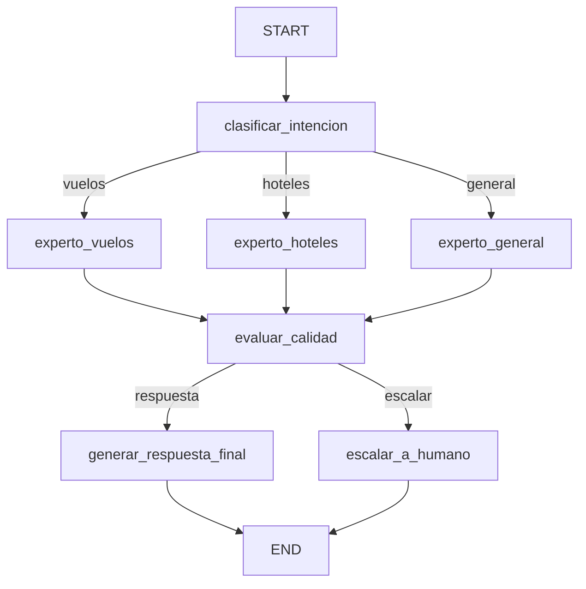

# TravelAI — Agente de Viajes con LangGraph y LangFuse

Agente inteligente para una agencia de viajes que utiliza **LangGraph**, **LangChain**, **OpenAI** y **LangFuse** para clasificar consultas de usuarios, dirigirlas al especialista correspondiente, evaluar la calidad de la respuesta y generar una respuesta final.

## Descripción

TravelAI recibe una consulta relacionada con viajes y ejecuta un flujo de procesamiento compuesto por varios nodos:

1. Clasificación de la intención del usuario.
2. Enrutamiento hacia un experto especializado.
3. Generación de una respuesta por parte del experto.
4. Evaluación de la calidad de la respuesta mediante un LLM como juez.
5. Decisión sobre si la respuesta puede enviarse al usuario o debe escalarse a un agente humano.
6. Generación de la respuesta final.

El flujo completo está implementado mediante un grafo de **LangGraph** y las llamadas a los modelos se monitorizan mediante **LangFuse**.

---

## Tecnologías utilizadas

* **Python**
* **LangGraph** — construcción y ejecución del grafo de agentes.
* **LangChain** — integración con modelos de lenguaje.
* **OpenAI** — modelo de lenguaje utilizado por el agente.
* **LangFuse** — observabilidad y trazabilidad de las ejecuciones.
* **Pydantic** — validación de las respuestas estructuradas del modelo.
* **python-dotenv** — gestión de variables de entorno.
* **Pytest** — pruebas del proyecto.

---

## Estructura del proyecto

```text
travel-ai-langgraph/
│
├── .env
├── .env.example
├── .gitignore
├── requirements.txt
├── main.py
│
├── src/
│   ├── __init__.py
│   │
│   ├── config/
│   │   ├── __init__.py
│   │   ├── settings.py
│   │   └── langfuse.py
│   │
│   ├── graph/
│   │   ├── __init__.py
│   │   ├── state.py
│   │   ├── nodes.py
│   │   ├── routers.py
│   │   └── graph.py
│   │
│   └── llm/
│       ├── __init__.py
│       └── models.py
│
└── test/
    ├── __init__.py
    ├── test_classifier.py
    ├── test_experts.py
    ├── test_quality.py
    ├── test_final.py
    ├── test_graph.py
    ├── test_langfuse.py
    └── test_mermaid.py
```

---

## Arquitectura del grafo

El agente está compuesto por siete nodos principales:

### 1. `clasificar_intencion`

Analiza el mensaje del usuario y determina su intención.

Las posibles categorías son:

* `vuelos`
* `hoteles`
* `general`

La clasificación se realiza mediante un modelo de lenguaje con salida estructurada.

### 2. `experto_vuelos`

Procesa las consultas relacionadas con vuelos.

Proporciona información y recomendaciones relacionadas con la búsqueda de vuelos, evitando inventar datos de disponibilidad, horarios o precios en tiempo real.

### 3. `experto_hoteles`

Procesa las consultas relacionadas con hoteles.

Proporciona recomendaciones y aspectos a tener en cuenta en una búsqueda de alojamiento, sin inventar datos de disponibilidad o precios actuales.

### 4. `experto_general`

Procesa consultas generales relacionadas con viajes, destinos, cultura o recomendaciones.

### 5. `evaluar_calidad`

Evalúa la respuesta generada por el experto mediante un **LLM-as-Judge**.

La evaluación tiene en cuenta aspectos como:

* Relevancia.
* Utilidad.
* Claridad.
* Fiabilidad.
* Adecuación a la consulta.

El resultado genera un `score_calidad` entre `0.0` y `1.0`.

### 6. `generar_respuesta_final`

Transforma la respuesta del experto en una respuesta final natural y adecuada para el usuario.

### 7. `escalar_a_humano`

Si la calidad obtenida no alcanza el nivel establecido, el flujo se deriva a un agente humano.

---

## Estado del agente

El estado utilizado por LangGraph se define mediante `AgentState`:

```python
class AgentState(TypedDict):
    mensaje_usuario: str
    intencion: str
    respuesta_especialista: str
    score_calidad: float
    requiere_escalado: bool
    respuesta_final: str
```

Este estado permite compartir la información necesaria entre los diferentes nodos del grafo.

---

## Flujo de ejecución

El flujo principal es:

```text
                    ┌─────────────────────────┐
                    │ clasificar_intencion    │
                    └────────────┬────────────┘
                                 │
              ┌──────────────────┼──────────────────┐
              │                  │                  │
           vuelos              hoteles           general
              │                  │                  │
              ▼                  ▼                  ▼
     experto_vuelos     experto_hoteles     experto_general
              │                  │                  │
              └──────────────────┼──────────────────┘
                                 ▼
                       ┌──────────────────┐
                       │ evaluar_calidad  │
                       └────────┬─────────┘
                                │
                    ┌───────────┴───────────┐
                    │                       │
              score >= 0.6             score < 0.6
                    │                       │
                    ▼                       ▼
       generar_respuesta_final      escalar_a_humano
                    │                       │
                    ▼                       ▼
                   END                     END
```

### Criterio de escalado

Se utiliza un umbral de calidad de:

```text
0.6
```

Si:

```text
score_calidad < 0.6
```

la consulta se deriva a un agente humano.

En caso contrario, se genera la respuesta final para el usuario.

---

## Integración con LangFuse

LangFuse se utiliza para obtener observabilidad sobre las ejecuciones del agente.

Las llamadas a los modelos se registran mediante el callback de LangFuse, permitiendo visualizar:

* Trazas de ejecución.
* Nodos ejecutados.
* Llamadas a modelos de lenguaje.
* Tiempo de ejecución.
* Flujo completo de la consulta.

La integración se configura mediante las variables de entorno correspondientes.

### Variables de entorno

Crear un archivo `.env`:

```env
OPENAI_API_KEY=tu_clave_de_openai

LANGFUSE_PUBLIC_KEY=tu_clave_publica
LANGFUSE_SECRET_KEY=tu_clave_secreta
LANGFUSE_BASE_URL=https://cloud.langfuse.com
```

Las claves reales no deben incluirse en el repositorio.

---

## Instalación

### 1. Crear el entorno virtual

En Windows:

```bash
python -m venv .venv
```

Activar el entorno:

```bash
.venv\Scripts\activate
```

### 2. Instalar las dependencias

```bash
pip install -r requirements.txt
```

### 3. Configurar las variables de entorno

Crear el archivo `.env` con las claves de OpenAI y LangFuse.

---

## Ejecución

El proyecto puede ejecutarse utilizando los scripts de prueba incluidos en la carpeta `test`.

### Probar la clasificación

```bash
python -m test.test_classifier
```

### Probar los expertos

```bash
python -m test.test_experts
```

### Probar la evaluación de calidad

```bash
python -m test.test_quality
```

### Probar la generación de respuestas

```bash
python -m test.test_final
```

### Ejecutar el flujo completo

```bash
python -m test.test_graph
```

### Comprobar la integración con LangFuse

```bash
python -m test.test_langfuse
```

### Generar el diagrama Mermaid

```bash
python -m test.test_mermaid
```

---

## Casos de prueba principales

El flujo completo se prueba con tres consultas representativas.

### Consulta de vuelos

```text
Quiero un vuelo de Madrid a París para el 15 de marzo
```

Resultado esperado:

```text
Intención: vuelos
```

La consulta se dirige a `experto_vuelos`.

### Consulta de hoteles

```text
Busco un hotel con piscina en Barcelona para 2 noches
```

Resultado esperado:

```text
Intención: hoteles
```

La consulta se dirige a `experto_hoteles`.

### Consulta general

```text
¿Cuál es la mejor época para visitar Japón?
```

Resultado esperado:

```text
Intención: general
```

La consulta se dirige a `experto_general`.

---

## Resultados obtenidos

En las pruebas realizadas, el flujo completo funcionó correctamente para los tres casos principales:

| Caso                           | Intención | Score de calidad | Escalado |
| ------------------------------ | --------- | ---------------: | -------- |
| Vuelo Madrid → París           | `vuelos`  |              0.8 | No       |
| Hotel en Barcelona             | `hoteles` |              1.0 | No       |
| Mejor época para visitar Japón | `general` |              1.0 | No       |

Los valores del `score_calidad` pueden variar ligeramente entre ejecuciones debido a que la evaluación es realizada por un modelo de lenguaje.

---

## Diagrama Mermaid

El grafo puede visualizarse mediante Mermaid utilizando:

```bash
python -m test.test_mermaid
```

El flujo generado por LangGraph contiene los siguientes caminos:



---

## Observabilidad

Las ejecuciones del grafo pueden consultarse en LangFuse para analizar la trazabilidad completa de una consulta.

Una ejecución típica permite observar el flujo:

```text
TravelAI
│
├── clasificar_intencion
│   └── LLM
│
├── experto_vuelos / experto_hoteles / experto_general
│   └── LLM
│
├── evaluar_calidad
│   └── LLM-as-Judge
│
└── generar_respuesta_final
    └── LLM
```

Esto permite analizar el comportamiento del agente y los tiempos empleados en cada etapa del procesamiento.

---

## Objetivo del proyecto

El objetivo es implementar un agente de viajes basado en grafos capaz de:

* Comprender la intención de una consulta.
* Enrutarla al especialista correspondiente.
* Generar una respuesta especializada.
* Evaluar automáticamente la calidad de dicha respuesta.
* Escalar la consulta cuando la calidad sea insuficiente.
* Mantener trazabilidad de las ejecuciones mediante LangFuse.

El proyecto demuestra el uso conjunto de **LangGraph, LangChain, OpenAI y LangFuse** para construir un flujo de agente con múltiples etapas y control de calidad.
